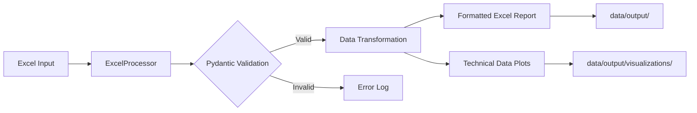

# Python Automation System

A robust, professional Python automation repository designed to ingest multi-sheet Excel workbooks, validate data integrity using Pydantic, and generate high-fidelity technical visualizations and formatted reports.

## Project Structure

```text
/
├── data/
│   ├── input/                # Source Excel workbooks
│   └── output/               # Processed Excel reports
│       └── visualizations/   # PNG technical plots
├── src/
│   └── core/
│       ├── processor.py      # ETL and Validation logic
│       └── visualizer.py     # Data plotting logic
├── tests/                    # Unit tests
├── config.yaml               # System configuration
├── entrypoint.py             # CLI Entrypoint
├── pyproject.toml            # Dependency management
└── README.md                 # Documentation
```

## Pipeline Architecture



## Features

- **Schema Validation**: Ensures incoming data strictly adheres to defined Pydantic models.
- **Automated Formatting**: Generates Excel reports with auto-adjusted column widths.
- **High-Fidelity Plots**: Creates 300 DPI technical visualizations using Matplotlib.
- **Centralized Config**: Manage paths, visualization styles, and logging via `config.yaml`.

## Setup Instructions

### Prerequisites
- Python 3.9+

### Installation
1. Clone the repository.
2. Install dependencies:
   ```bash
   pip install .
   ```

## Usage

Run the pipeline using the `entrypoint.py` script:

```bash
python entrypoint.py --input data/input/new_sample.xlsx
```

### Arguments
- `--config`: Path to the config file (default: `config.yaml`).
- `--input`: Path to the source Excel file (Required).
- `--output`: Name of the output report (default: `processed_report.xlsx`).

## Code Style
This project follows **PEP 8** guidelines. All code is type-hinted and documented using **Google-style docstrings**.
